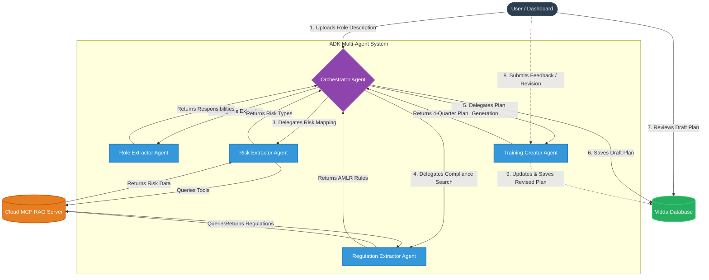

# Vidda Agentic Architecture

The following Mermaid diagram outlines the multi-agent ADK backend workflow and how it interacts with the Model Context Protocol (MCP) RAG server and Human-in-the-Loop review process.

